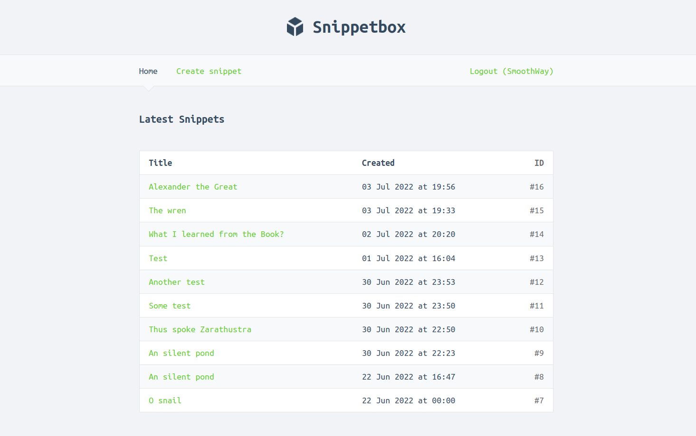

# Go application

This is the final code from version 1 of the [Let's Go e-book by Alex Edwards](https://lets-go.alexedwards.net/). It's a full-stack Go web application called "Snippetbox" that lets users CRUD text snippets (similar to GitHub gists).

### Features

- Authentication. Users can register and sign in.
- Protected endpoints. Only signed-in users can create snippets.
- RESTful routing.
- Middleware.
- PostgreSQL database.
- SSL/TLS web server using HTTP 2.0.
- Generated HTML via Golang templates.
- CRSF protection.

### How to run?

##### `go run ./cmd/web/`
to start the local web server with HTTPS on port 4000 ([https://localhost:4000](https://localhost:4000)).  
Or you can: 
##### `go run ./cmd/web/ --addr=:$PORT`  
and specify `$PORT` to what port you want to start the server.
